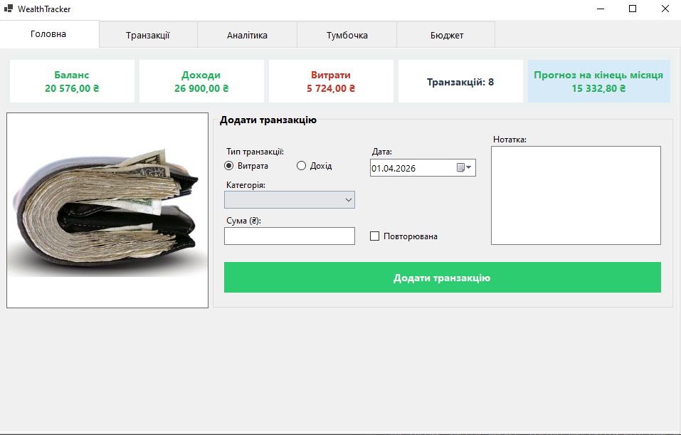
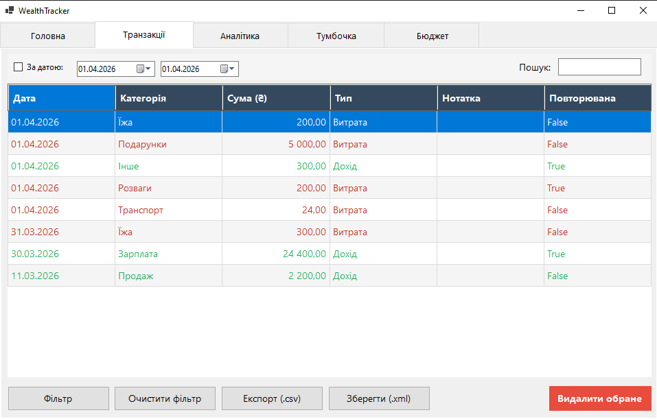
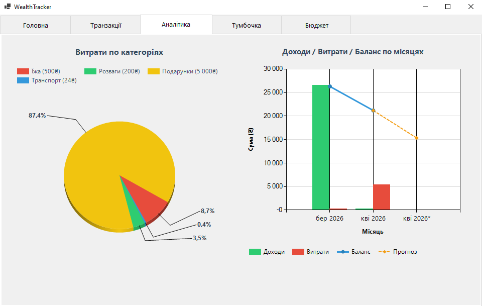
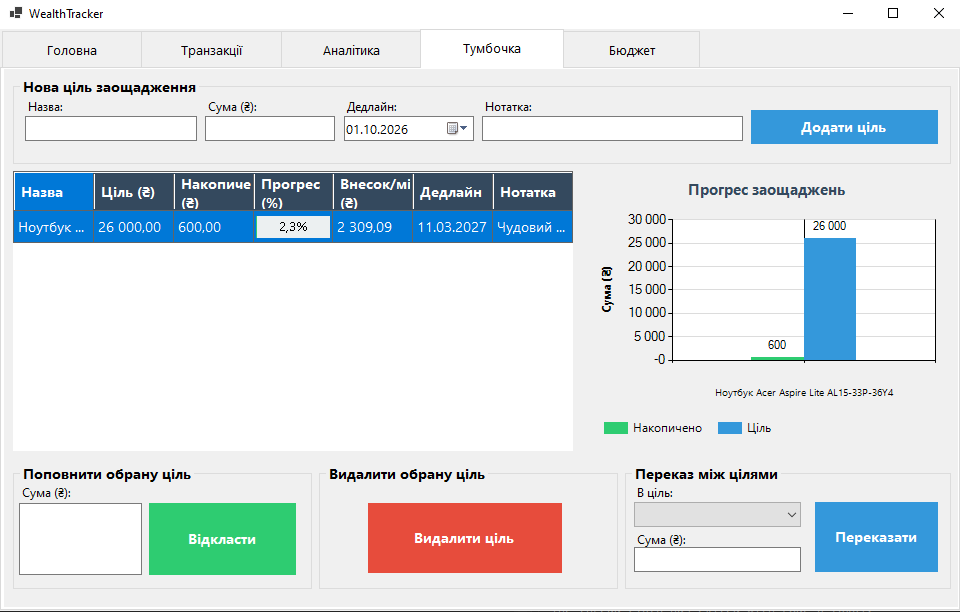
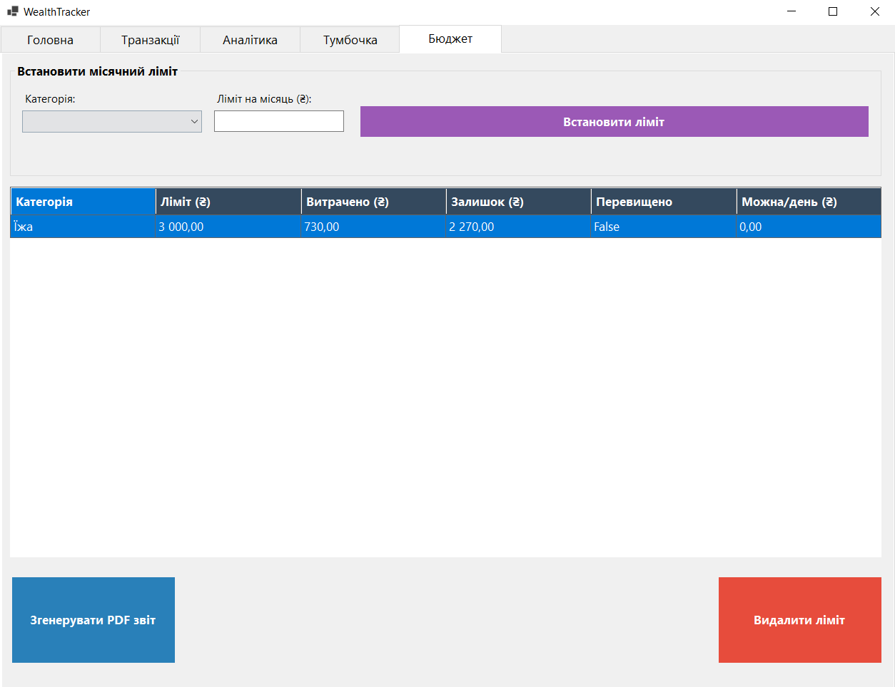
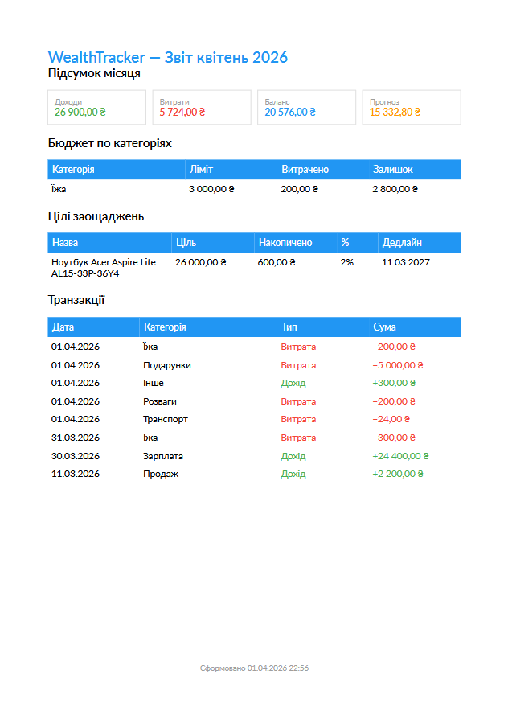
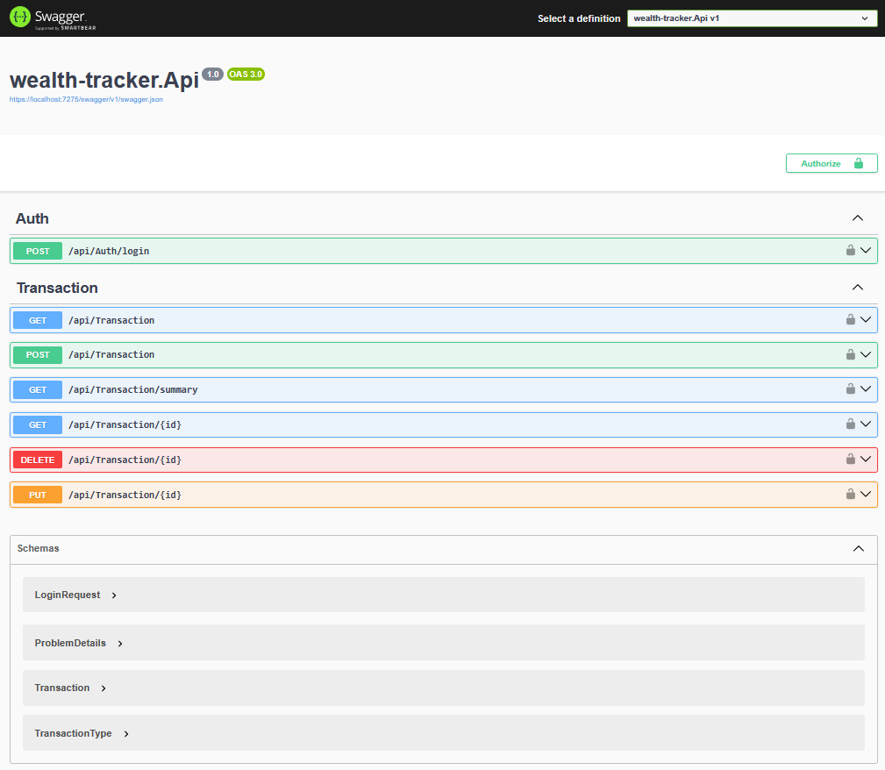

# WealthTracker

**WealthTracker** is a personal finance management desktop application built with **C# and .NET 8**, following the **MVP (Model-View-Presenter)** architectural pattern.

The project demonstrates how a clean architecture can power a full-featured finance tracker — from transaction logging to predictive analytics and automated savings planning.

---

## Screenshots









---

## Features

### Transactions
- Add income and expense transactions by category
- Delete transactions with confirmation dialog
- Filter by keyword, date range, and transaction type
- **Transaction notes** — attach a comment to any transaction
- **Recurring transactions** — mark a transaction as monthly and it will be added automatically on each startup

### Analytics & Forecasting
- **Monthly balance forecast** — projects your end-of-month balance based on average daily spending
- **Combined chart** — income/expense columns with a cumulative balance line and a dashed forecast segment
- **Pie chart** — expense breakdown by category with percentage labels
- Financial summary panel: total income, expenses, balance, and forecast at a glance

### Savings Goals ("Piggy Bank")
- Create goals with a name, target amount, deadline, and optional note
- Deposit money into a goal from your main balance
- Auto-calculated **monthly contribution** required to meet the deadline
- Visual progress tracking — completed goals are highlighted green

### Budget Limits
- Set monthly spending limits per expense category
- Real-time tracking of spent vs. remaining amounts
- **Daily allowance** calculation — how much you can spend per day to stay within budget
- Exceeded limits are highlighted red

### Reports
- Export transactions to **CSV**
- Save data snapshot as **XML**
- Generate a full **PDF report** (via QuestPDF) including summary, budget limits, savings goals, and transaction history

---

## Tech Stack

| Layer | Technology |
|---|---|
| Language | C# (.NET 8) |
| UI | Windows Forms |
| Charts | Microsoft Chart Controls (MSChart) |
| ORM | Entity Framework Core |
| Database | SQLite |
| PDF Export | QuestPDF (Community) |
| CSV Export | CsvHelper |
| Architecture | MVP (Model-View-Presenter) |
| DI Container | Microsoft.Extensions.DependencyInjection |
| Testing | xUnit, Moq, EF Core InMemory |

---

## Architecture

```
View (WinForms Form)
      ↓
Presenter  (event handling, orchestration)
      ↓
Services   (business logic, forecasting, calculations)
      ↓
EfPersistenceService  (EF Core read/write)
      ↓
AppDbContext → SQLite
```

Each layer has a single responsibility. The `IWealthView` interface decouples the form from the presenter, making the business logic fully testable without a UI.

---

## Project Structure

```
wealth-tracker/
│
├── wealth-tracker/                  # WinForms desktop application
│   ├── Forms/
│   │   ├── WealthTracker.cs         # Main form (IWealthView implementation)
│   │   └── WealthTracker.Designer.cs
│   ├── Models/
│   │   ├── Transaction.cs           # Transaction model with INotifyPropertyChanged
│   │   ├── SavingsGoal.cs           # Savings goal with progress calculations
│   │   ├── BudgetLimit.cs           # Budget limit with daily allowance logic
│   │   ├── TransactionFilter.cs
│   │   └── WealthSummary.cs
│   ├── Presenter/
│   │   ├── IWealthView.cs           # View contract
│   │   └── WealthPresenter.cs       # All event handlers and orchestration
│   ├── Services/
│   │   ├── TransactionService.cs    # Filtering, aggregation, forecast
│   │   ├── SavingsGoalService.cs    # Goal CRUD and deposit logic
│   │   ├── BudgetService.cs         # Limit CRUD and spent recalculation
│   │   ├── ReportService.cs         # PDF generation via QuestPDF
│   │   ├── ExportService.cs         # CSV export
│   │   ├── EfPersistenceService.cs  # EF Core persistence
│   │   └── IPersistenceService.cs
│   └── Data/
│       └── AppDbContext.cs
│
├── wealth-tracker.Api/              # ASP.NET Core Web API
│   ├── Controllers/
│   ├── Services/
│   └── DTOs/
│
└── wealth-tracker.Tests/            # Unit tests
    ├── TransactionServiceTests.cs
    ├── WealthPresenterTests.cs
    └── WealthSummaryTests.cs
```

---

## Getting Started

### Prerequisites
- Windows OS
- Visual Studio 2022+
- .NET 8 SDK
- dotnet-ef tool: `dotnet tool install --global dotnet-ef`

### Installation

```bash
git clone https://github.com/aemuw/wealth-tracker.git
cd wealth-tracker
```

Open `wealth-tracker.sln` in Visual Studio and press **F5**.

The database is created automatically on first run via EF Core migrations.

---

## Key Business Logic

### Month-end Balance Forecast
```
avgDailyExpense = monthExpenses / currentDay
forecast = currentBalance − avgDailyExpense × daysRemaining
```

### Monthly Contribution for Savings Goal
```
monthsLeft = months between now and deadline
monthlyRequired = (targetAmount − savedAmount) / monthsLeft
```

### Budget Daily Allowance
```
daysLeft = daysInMonth − today
dailyAllowance = (limitAmount − spentAmount) / daysLeft
```

---

## API Overview

```
POST   /api/auth/login
GET    /api/transactions
POST   /api/transactions
GET    /api/transactions/{id}
PUT    /api/transactions/{id}
DELETE /api/transactions/{id}
GET    /api/transactions/summary
```

The API uses **JWT authentication** and **Entity Framework Core with SQLite**.

---

## Roadmap

- [x] MVP pattern with full separation of concerns
- [x] EF Core persistence with SQLite
- [x] Pie chart + combined bar/line chart with forecast
- [x] Savings goals with monthly contribution calculator
- [x] Monthly budget limits with daily allowance
- [x] Recurring transactions (auto-applied on startup)
- [x] Transaction notes
- [x] PDF report generation (QuestPDF)
- [x] CSV and XML export
- [x] Unit tests with xUnit and Moq
- [ ] Repository pattern
- [ ] FluentValidation
- [ ] Undo/Redo via Command pattern
- [ ] API integration tests

---

## What I Learned

- Implementing the **MVP pattern** in a real WinForms application
- Designing **layered architecture** with clear separation of concerns
- Using **Entity Framework Core** with migrations and async operations
- Building **REST APIs** with ASP.NET Core and JWT authentication
- Writing **unit tests** with xUnit, Moq, and EF Core InMemory
- Working with **MSChart** for multi-series combined visualizations
- Generating **PDF documents** programmatically with QuestPDF
- Using **LINQ** for filtering, grouping, aggregation and forecasting
- Applying **Microsoft.Extensions.DependencyInjection** in a desktop app

---

## License

MIT
