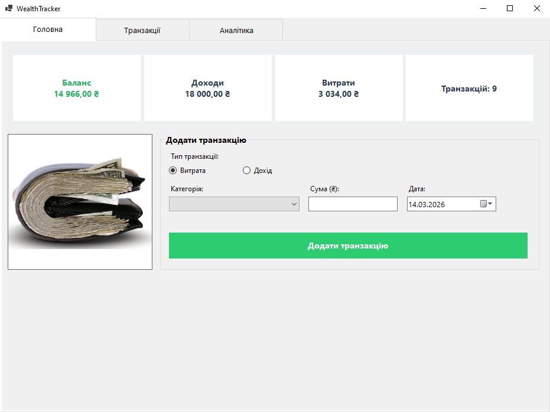

# WealthTracker

A personal finance tracking desktop application built with C# Windows Forms,
following the MVP (Model-View-Presenter) architectural pattern.

## Screenshot
<!-- Add screenshot after launch -->


## Features
- Add income and expense transactions by category
- Delete transactions with confirmation
- Filter transactions by keyword and date range
- Pie chart of expenses by category
- Line chart showing balance over time
- Auto-save to JSON per user profile
- Export to CSV and XML
- Visual wallet status indicator based on balance

## Tech Stack
- **Language:** C# (.NET 8)
- **UI:** Windows Forms
- **Charts:** Microsoft Chart Controls (MSChart)
- **Serialization:** System.Text.Json
- **Storage:** JSON (per-user file), XML export
- **Pattern:** MVP (Model-View-Presenter)

## Getting Started

### Prerequisites
- Windows OS
- Visual Studio 2022 or later
- .NET 8 SDK

### Installation
```bash
git clone https://github.com/aemuw/wealth-tracker.git
cd wealth-tracker
```
Then open `wealth-tracker.sln` in Visual Studio and press **F5** to run.

## Roadmap
- [ ] Replace sync file I/O with async/await
- [ ] Migrate from JSON to SQLite via Entity Framework Core
- [ ] Add unit tests with xUnit and Moq
- [ ] Move SaveFileDialog out of Presenter (clean MVP)
- [ ] Add Undo/Redo via Command pattern
- [ ] ASP.NET Core Web API version

## What I Learned
- Implementing MVP pattern in a Windows Forms application
- Separating concerns between UI, business logic, and persistence
- Using INotifyPropertyChanged and BindingList for data binding
- LINQ for filtering, grouping, and aggregation
- JSON serialization with System.Text.Json
- Working with MSChart for data visualization

## License
MIT
